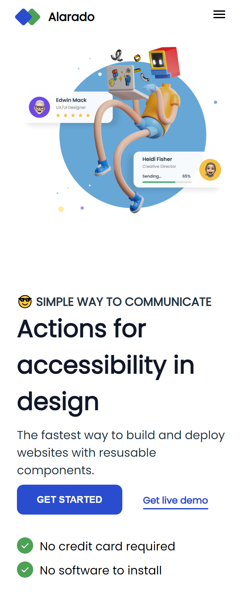
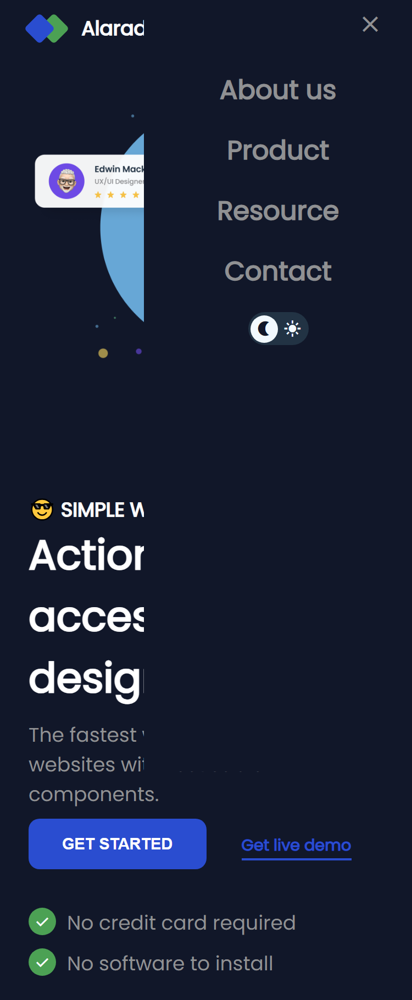
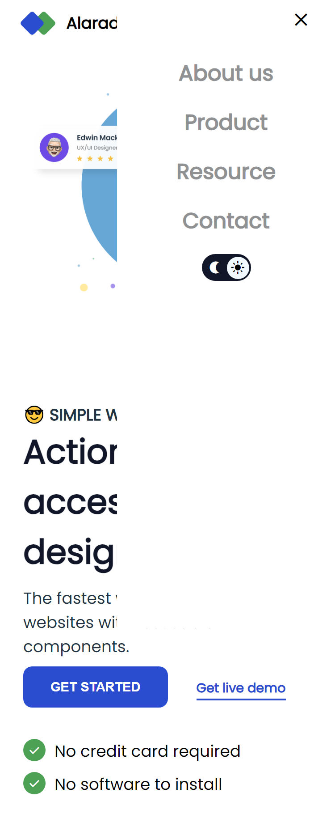
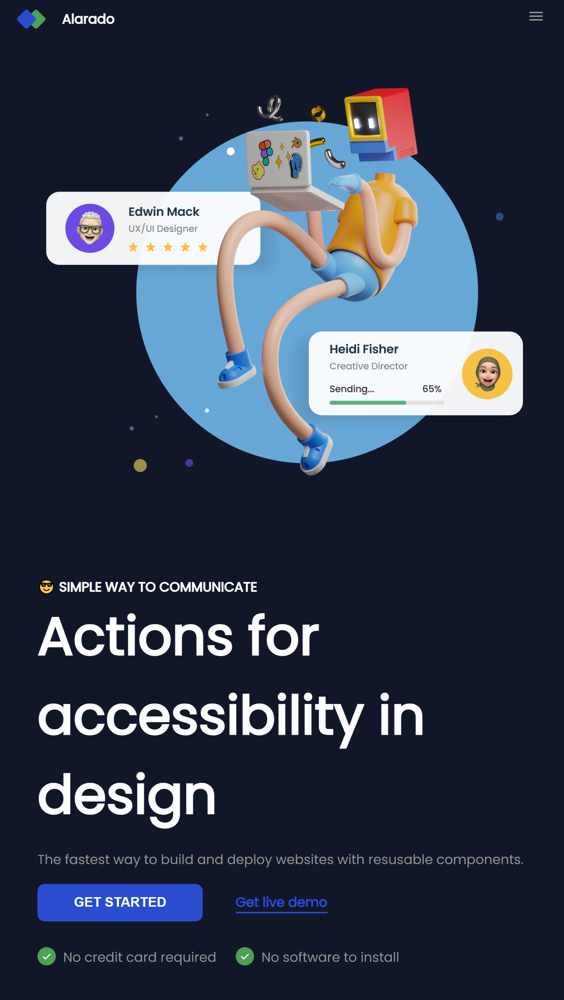
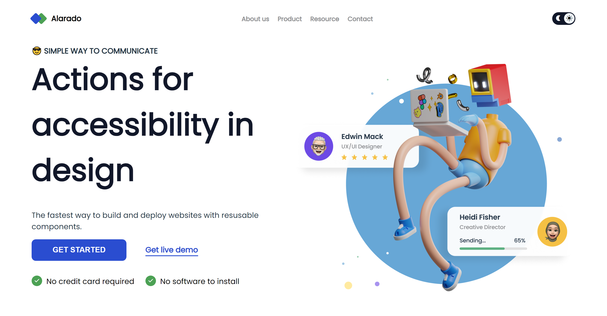
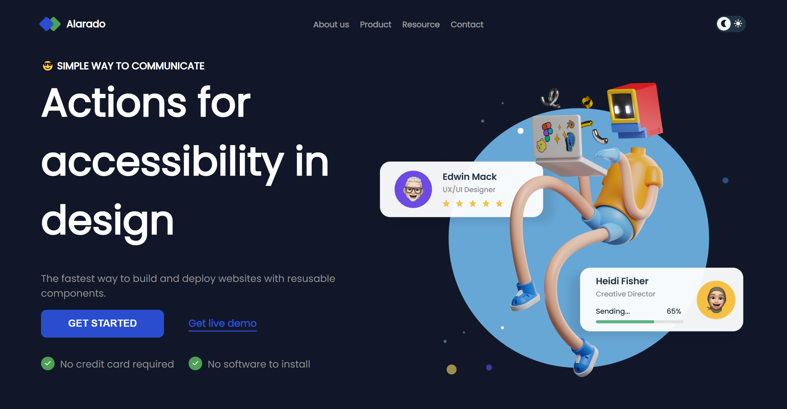

# ALARADO Homepage

This is a solution to the [alarado homepage](https://devchallenges.io/editor/solution/9463).

## Table of contents

- [Overview](#overview)
  - [The challenge](#the-challenge)
  - [Screenshot](#screenshot)
  - [Links](#links)
- [My process](#my-process)
  - [Built with](#built-with)
- [Author](#author)

## Overview

### The challenge

Users should be able to:

- View the optimal layout for the site depending on their device's screen size
- See hover states for all interactive elements on the page

### Screenshot
### mobile

### tablet

### desktop

### Links

- Live Site URL: [https://jarher.github.io/alardoResponsiveHomepage/]

## My process

### Built with

- Semantic HTML5 markup
- CSS custom properties
- Flexbox
- Mobile-first workflow

## Author

- Website - [https://github.com/jarher]
- Frontend Mentor - [https://www.frontendmentor.io/profile/jarher]

